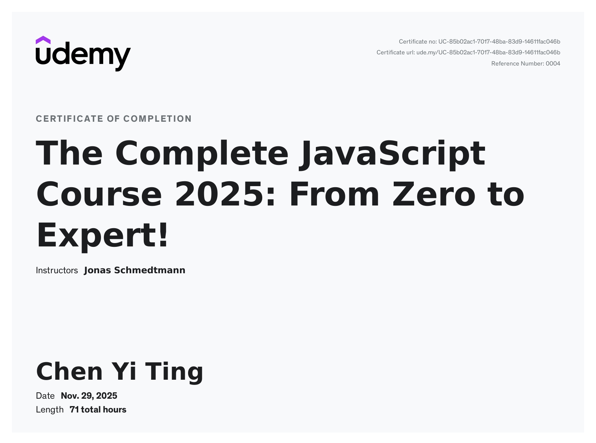

# JavaScript Pratices Project🐣

The Repo purpose to Learning/Practices/NOTES and enlighten JavaScript from [The Complete JavaScript Course 2025: From Zero to Expert!](https://www.udemy.com/course/the-complete-javascript-course/?couponCode=ST15MT20425G1) Online Course by Jonas Schmedtmann 👍

## Folder Structure

```
/javascript-practices
│
│
├── Project1_GuessTheNumber/
│   ├── index.html
│   ├── script.js
│   ├── style.css
│   └── README.md
│
├── Project2_ModalWindow/
│   ├── index.html
|   |── style.css
│   ├── script.js
│   └── README.md
│
├── Project3_PigGame/
|   |── images
│   ├── index.html
|   |── style.css
│   ├── script.js
│   └── README.md
│
├── Project4_BankistApp/
|   |── media
│   ├── index.html
|   |── style.css
│   ├── script.js
│   └── README.md
|
├── Project5_BankistWebsite/
|   |── img
|   |──.prettierrc
│   ├── index.html
|   |── style.css
│   ├── script.js
│   └── README.md
│
└── README.md
```

## Project List:

1. **[Guess the Number](./Project1_GuessTheNumber)** ('guess-the-number'): a simple guess number game, player need to guess number between 1 to 20.

2. **[Modal Window](./Project2_ModalWindow)** ('modal-window'): a simple simulation to handle Open/Close/Pass Event.

3. **[Pig Game](./Project3_PigGame)** ('pig-game'): a two-player dice game where players take turns to roll a dice and accumulate points.

4. **[BankistApp](./Project4_BankistApp)** ('bankist'): a banking demo app that allows users to log in, view transactions, transfer money, request loans, and close accounts. Demonstrates modern JavaScript array methods and UI updates.

5. **[BankistWebsite](./Project5_BankistWebsite)** ('bankistWebsite'): A modern, interactive banking landing page demo. This project demonstrates advanced DOM manipulation, event handling, and UI effects using vanilla JavaScript and CSS.

## Planing Update

1. Build a simple feature show all the files i practices or Project(Modal), exploring like code edite on website and could execute then show the result.

## Course Complete Certificate


